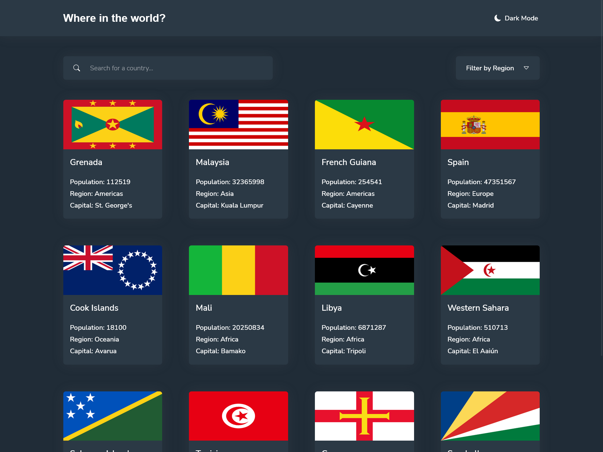
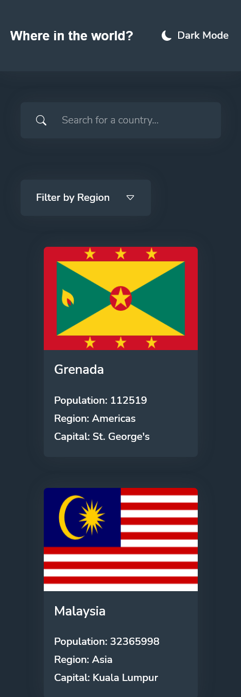
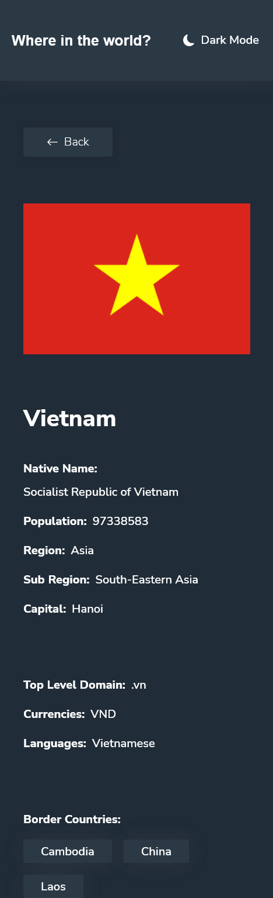
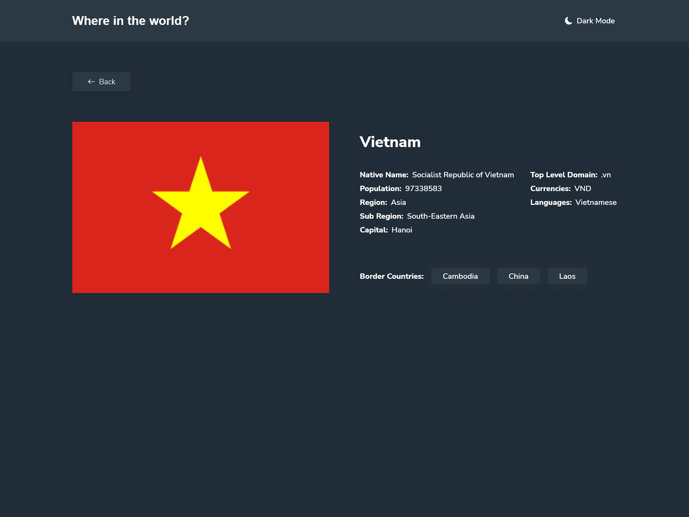

# Frontend Mentor - REST Countries API with color theme switcher solution

This is a solution to the [REST Countries API with color theme switcher challenge on Frontend Mentor](https://www.frontendmentor.io/challenges/rest-countries-api-with-color-theme-switcher-5cacc469fec04111f7b848ca). Frontend Mentor challenges help you improve your coding skills by building realistic projects. 

## Table of contents

- [Frontend Mentor - REST Countries API with color theme switcher solution](#frontend-mentor---rest-countries-api-with-color-theme-switcher-solution)
  - [Table of contents](#table-of-contents)
  - [Overview](#overview)
    - [The challenge](#the-challenge)
    - [Screenshot](#screenshot)
    - [Links](#links)
  - [My process](#my-process)
    - [Built with](#built-with)
    - [What I learned](#what-i-learned)
    - [Continued development](#continued-development)
    - [Useful resources](#useful-resources)
  - [Author](#author)

## Overview

### The challenge

Users should be able to:

- See all countries from the API on the homepage
- Search for a country using an `input` field
- Filter countries by region
- Click on a country to see more detailed information on a separate page
- Click through to the border countries on the detail page
- Toggle the color scheme between light and dark mode *(optional)*

### Screenshot

### Links

- Solution URL: [Add solution URL here](https://github.com/Hatter-s/rest-countries-api-with-color-theme-switcher)
- Live Site URL: [Add live site URL here](https://hatter-rest-countries-api.netlify.app/)

## My process

### Built with

- Semantic HTML5 markup
- [SCSS(sass)](https://sass-lang.com/) v1.57
- [React](https://reactjs.org/) v18.2 - JS library
- [React Router](https://reactrouter.com/en/main) v6.6
- [Bootstrap Icons](https://icons.getbootstrap.com/) v1.10

### What I learned

- Will update later
### Continued development

- Routing this current project was routing so bad and messy, so i want to level it up to something clear, easy to read and contain in one place to make it easy to keep track
- Make og tag so when I share it they will know what website talk about
- Change sass to tailwind because I think sass take more time than use tailwind and it make me so much time to name some element just for styling it

### Useful resources

- [React router tutorial](https://reactrouter.com/en/main/start/tutorial) - Good to learn react router when you don't have any experience.

## Author

- Website - [Hatter](https://github.com/Hatter-s)
- Frontend Mentor - [@Hatter-s](https://www.frontendmentor.io/profile/Hatter-s)
- Twitter - [@ThnhV06299393](https://twitter.com/ThnhV06299393)
